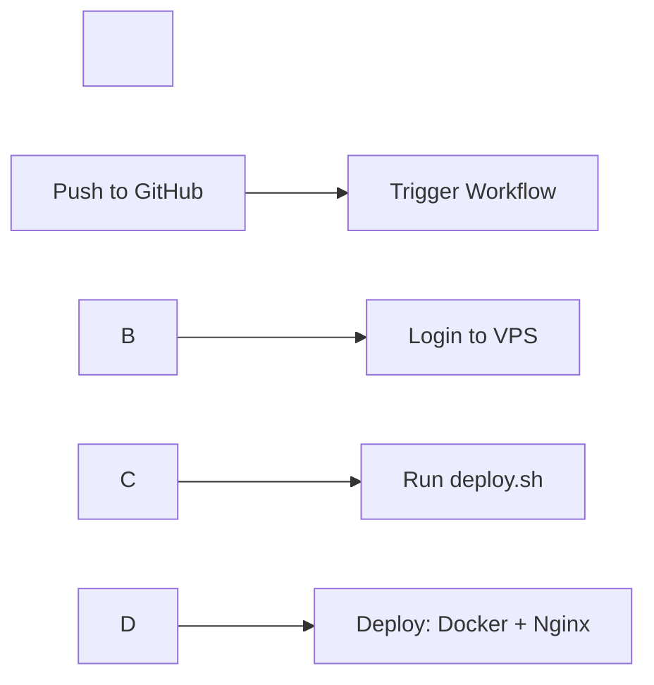

<div align="center">


\# 👨‍💻 مهندس DevOps


\[!\[LinkedIn](https://img.shields.io/badge/LinkedIn-0077B5?style=for-the-badge\&logo=linkedin\&logoColor=white)](https://linkedin.com)

\[!\[Email](https://img.shields.io/badge/Email-D14836?style=for-the-badge\&logo=gmail\&logoColor=white)](mailto:wolfix007.xiflow@gmail.com)

\[!\[GitHub](https://img.shields.io/badge/GitHub-100000?style=for-the-badge\&logo=github\&logoColor=white)](https://github.com/wolfixor)


</div>


---


\## 🚀 درباره من


مهندس \*\*DevOps\*\* با تجربه در طراحی، پیادهسازی و مدیریت زیرساختهای مبتنی بر:


\- 🏗️ \*\*Infrastructure as Code (IaC)\*\*

\- 🐳 \*\*کانتینرسازی و Kubernetes\*\*

\- 🔒 \*\*امنیت زیرساخت\*\*

\- ⚙️ \*\*CI/CD Pipeline\*\*


\### 🌟 پروژه شاخص


\*\*پلتفرم سایت‌ساز\*\* - مدیریت کامل زنجیره DevOps، CI/CD، IaC، امنیت و بخشی از Backend


> 💡 این سیستم قادر است در \*\*کمتر از ۱ دقیقه\*\* یک سایت جدید ایجاد کند و در آینده با هوش مصنوعی و «تک پرامپت» تکمیل خواهد شد.


---


\## 💼 پروژه‌ها


\### 🏘️ \[پروژه املاک](https://oujamlak.ir)


\*\*توضیحات:\*\*

\- سایت + چت سرویس جداگانه

\- استقرار روی VPS با CI/CD (Bash Script) 

\- قابلیت Rollback


\*\*تکنولوژی‌ها:\*\*

```

Docker | Nginx | GitHub Actions | Node.js

```


\*\*🔗 ریپوزیتوری:\*\* \[Chat App](https://github.com/wolfixor/chat-app)


\*\*📊 فلوی استقرار:\*\*




---


\### 👔 \[پروژه تیران](https://www.tiranstyle.com)


\*\*توضیحات:\*\*

\- استقرار روی VPS با CI/CD GitLab

\- ریپوزیتوری: `Private`


\*\*تکنولوژی‌ها:\*\*

```

GitLab CI/CD | VPS | Docker

```


---


\### 🔍 پروژه Python – ابزار امنیت و DevOps


\*\*Asset Discovery (FastAPI)\*\*


ابزاری برای پیدا کردن دارایی‌های سازمان‌ها


\*\*🔗 ریپوزیتوری:\*\* \[Asset Discovery](https://github.com/wolfix1234/asset-discovery)


\*\*تکنولوژی‌ها:\*\*

```

Python | FastAPI | Security Tools

```


---


\### 🏗️ پلتفرم Site-Builder (در حال توسعه)


<div align="center">


| سرویس | لینک | وضعیت |

|-------|------|-------|

| 🌐 سایت اصلی | \[wolfixsite.shop](https://www.wolfixsite.shop) | ⚠️ ممکن است پایین باشد |

| 📊 داشبورد ادمین | \[dashboard](https://dashboard.wolfixsite.shop) | ⚠️ ممکن است پایین باشد |

| 🛠️ سرویس ساخت سایت | \[complex](https://complex.wolfixsite.shop) | ⚠️ ممکن است پایین باشد |

| 🔗 دامنه کاربر | \[storeid](https://storeid.wolfixsite.shop) | زیردامنه خودکار |


</div>


\#### 🏛️ معماری پروژه


```yaml

Cloud Provider: ArvanCloud

Architecture: Microservices

CI/CD: GitHub Actions

IaC: Terraform

Part Of Backend: FastAPI

Frontend and backend: Next.js

Monitoring: Prometheus + Grafana

Orchestration: Kubernetes

```


\#### 🔄 محیط‌های استقرار


```

Development → Staging → Production

```


هر سرویس دارای \*\*CI/CD مستقل\*\* و استقرار اتوماتیک با Terraform روی ArvanCloud Kubernetes


\#### 👨‍💼 نقش من


\- ✅ طراحی کامل DevOps

\- ✅ Infrastructure as Code (IaC)

\- ✅ CI/CD Pipeline

\- ✅ امنیت زیرساخت

\- ✅ بخشی از Backend Development


\#### 📂 نمونه کدها


\- 🔧 \[Terraform \& IaC](https://github.com/wolfixor/resume/tree/main/IAC)

\- 🔄 \[ArgoCD Configuration](https://github.com/wolfixor/resume/tree/main/argoCD)

\- 📊 \[Observability Stack](https://github.com/wolfixor/resume/tree/main/observability-full-stack)


---


\## 🛠️ مهارت‌های تکنیکی


<div align="center">


\### ☁️ Cloud \& Infrastructure

!\[Kubernetes](https://img.shields.io/badge/kubernetes-%23326ce5.svg?style=for-the-badge\&logo=kubernetes\&logoColor=white)

!\[Docker](https://img.shields.io/badge/docker-%230db7ed.svg?style=for-the-badge\&logo=docker\&logoColor=white)

!\[Terraform](https://img.shields.io/badge/terraform-%235835CC.svg?style=for-the-badge\&logo=terraform\&logoColor=white)

!\[ArgoCD](https://img.shields.io/badge/ArgoCD-EF7B4D?style=for-the-badge\&logo=argo\&logoColor=white)


\### 🔄 CI/CD \& Automation

!\[GitHub Actions](https://img.shields.io/badge/github%20actions-%232671E5.svg?style=for-the-badge\&logo=githubactions\&logoColor=white)

!\[GitLab CI](https://img.shields.io/badge/gitlab%20ci-%23181717.svg?style=for-the-badge\&logo=gitlab\&logoColor=white)


\### 📊 Monitoring \& Observability

!\[Prometheus](https://img.shields.io/badge/Prometheus-E6522C?style=for-the-badge\&logo=Prometheus\&logoColor=white)

!\[Grafana](https://img.shields.io/badge/grafana-%23F46800.svg?style=for-the-badge\&logo=grafana\&logoColor=white)


\### 💻 Development

!\[Python](https://img.shields.io/badge/python-3670A0?style=for-the-badge\&logo=python\&logoColor=ffdd54)

!\[FastAPI](https://img.shields.io/badge/FastAPI-005571?style=for-the-badge\&logo=fastapi)

!\[Next JS](https://img.shields.io/badge/Next-black?style=for-the-badge\&logo=next.js\&logoColor=white)

!\[NodeJS](https://img.shields.io/badge/node.js-6DA55F?style=for-the-badge\&logo=node.js\&logoColor=white)


\### 🔒 Security

!\[Security](https://img.shields.io/badge/Security-Scanning-red?style=for-the-badge)


</div>


---


\## 💼 سوابق کاری


| نقش | شرکت | مدت زمان |

|-----|------|----------|

| 🚀 \*\*مهندس DevOps \& Backend Developer\*\* | استارتآپ سایت‌ساز | شهریور ۱۴۰۳ - کنون |

| 🐛 \*\*فریلنسر باگ‌بانتی\*\* | مستقل | شهریور ۱۴۰۲ - کنون |


---


\## 🎓 تحصیلات


\*\*کاردانی فناوری اطلاعات\*\* - در حال تحصیل


---


\## 📫 اطلاعات تماس


<div align="center">


📧 \*\*ایمیل:\*\* \[wolfix007.xiflow@gmail.com](mailto:wolfix007.xiflow@gmail.com)


---


\*\*ساخته شده با ❤️ توسط یک مهندس DevOps\*\*


</div>


